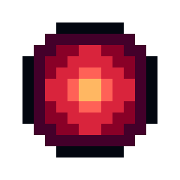

   
# GrudgePixel
   
  

GrudgePixel is a streamlined pixel art editor designed to provide an efficient and user-friendly experience. With its focus on speed, minimalism, and ease of use, GrudgePixel stands out as a top choice for both beginners and experienced pixel artists.

 

## Showcase

<table style="width:100%; text-align:center;">
  <tr>
    <td></td>
    <td></td>
    <td></td>
  </tr>
  <tr>
    <td></td>
    <td></td>
    <td></td>
  </tr>
</table>

## Why GrudgePixel?

**Optimized Performance**: GrudgePixel is engineered for exceptional speed and responsiveness. Unlike many pixel art editors that can be sluggish or bloated, GrudgePixel ensures smooth operation even with complex animations and large canvases.

**Memory Efficiency**: By avoiding unnecessary features and focusing on core functionality, GrudgePixel keeps memory usage low. This allows it to run seamlessly on a variety of systems, including those with limited resources.

**Simplicity & Usability**: GrudgePixel offers an intuitive interface that eliminates the need for extensive training. Its minimalist design helps users focus on their art without being overwhelmed by extraneous tools and options.

**Minimal Bloat**: Many pixel art editors come with a plethora of features that can make them cumbersome. GrudgePixel avoids this by providing only the essential tools needed for pixel art creation, ensuring a faster and more enjoyable user experience.

> [!TIP]
> Don't overthink about what to make or what colours to choose, just start creating!

## Download

For more information and to download GrudgePixel, visit this [page](https://datavorous.github.io/GrudgePixel/).

> [!CAUTION]
> This is not a virus. Check [here](https://www.virustotal.com/gui/file/f9045baa01ebd5227785c104dea1051a42ce1cc2da9b7576ba72b696aaac147b). If your system doesnt allow it, build from source, follow the raylib website.

## User Manual
Please check out the manual [here](https://datavorous.github.io/GrudgePixel/#manual).

## Contributing

We welcome contributions to improve GrudgePixel!

## License

GrudgePixel is licensed under the GPL 3.0 License. See [LICENSE](LICENSE) for more information.

## Contact

For support or inquiries, please create an issue.
